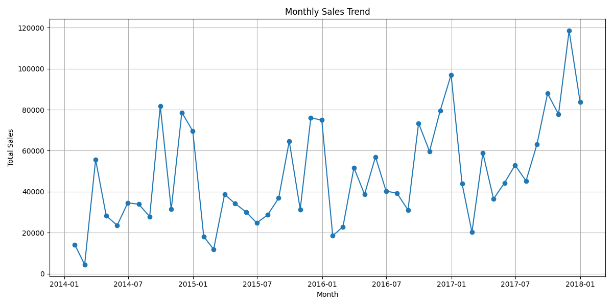
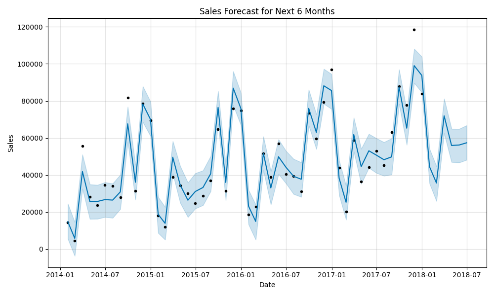
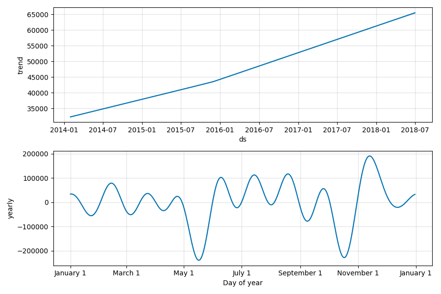
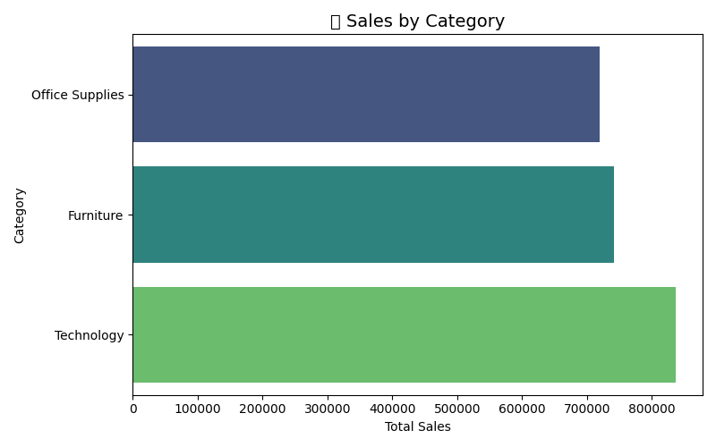
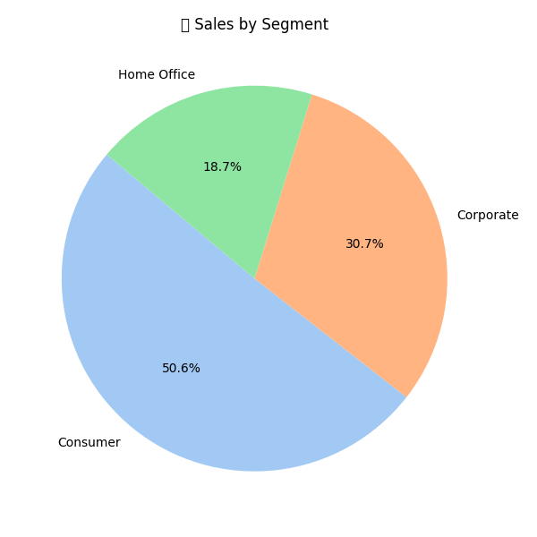
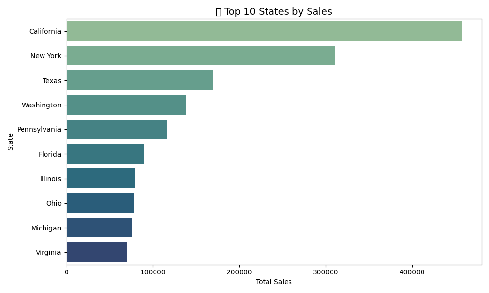

# 📊 AI-Powered Sales Forecasting Dashboard

This project was created as part of **Task 1 of the Machine Learning Internship** by **Future Interns**.  
It focuses on analyzing sales trends and forecasting future performance using **time series modeling with Facebook Prophet**.

The project is visualized through a Streamlit dashboard showcasing key insights and predictions.

---

## 🧠 Objective

| Goal                                             | Description                                                  |
|--------------------------------------------------|--------------------------------------------------------------|
| 📈 Analyze sales trends                          | Understand month-over-month variations and seasonality       |
| 🔮 Forecast future performance                   | Predict sales for the next 6 months using AI forecasting     |
| 📊 Visualize business insights                   | Break down sales by segment, category, and region            |

---

## 🤖 About Prophet

| Feature              | Description                                                                 |
|----------------------|-----------------------------------------------------------------------------|
| 🧠 Developed by      | Facebook’s AI Research (FAIR)                                                |
| 📦 Type              | Time series forecasting model (additive regression)                         |
| 🔁 Model training    | Internally fits trend, seasonality, and holiday effects to your data         |
| ⚙️ Handles           | Missing data, outliers, changepoints, and nonlinear trends                  |
| 🔮 Output            | Forecasted values with uncertainty intervals                                |

Prophet is built to make time-series forecasting **automated, scalable, and accurate** even with minimal tuning.

---

## 🛠️ Tech Stack Used

| Tool         | Purpose                            |
|--------------|-------------------------------------|
| `pandas`     | Data manipulation and grouping      |
| `matplotlib` | Basic plotting                      |
| `seaborn`    | Clean, colorful business-style charts |
| `prophet`    | AI model for time-series forecasting|
| `streamlit`  | Dashboard app to present insights   |

---

## 📁 Project Structure

| File/Folder           | Purpose                                           |
|------------------------|--------------------------------------------------|
| `Data/`                | Contains `superstore_sales.csv` dataset          |
| `Images/`              | All generated plots for trends and insights      |
| `forecasting_model.py` | Loads data, trains Prophet model, saves plots    |
| `dashboard.py`         | Streamlit UI to present all visuals as a dashboard |
| `README.md`            | Project summary and documentation                |

---

## 📈 Key Visuals & Insights

### 🔹 Monthly Sales Trend
Sales consistently increased with seasonal peaks in Nov–Dec.



### 🔹 Prophet Forecast (6 Months Ahead)
Prophet predicts a continued upward trend, with higher confidence near holidays.



### 🔹 Trend & Seasonality Breakdown
Seasonality shows recurring spikes around November, likely festive sales.



---

## 📊 Business Insights

| Visual                    | Insight                                                                 |
|---------------------------|-------------------------------------------------------------------------|
| 📦 Sales by Category       | Office Supplies lead in volume; Furniture slightly behind               |
| 👥 Sales by Segment        | Consumer segment dominates with 50%+ share                              |
| 📍 Top 10 States           | California is the highest contributor, followed by New York and Texas   |





---

## 🖥️ Streamlit Dashboard

To run the dashboard:

```bash
streamlit run dashboard.py
